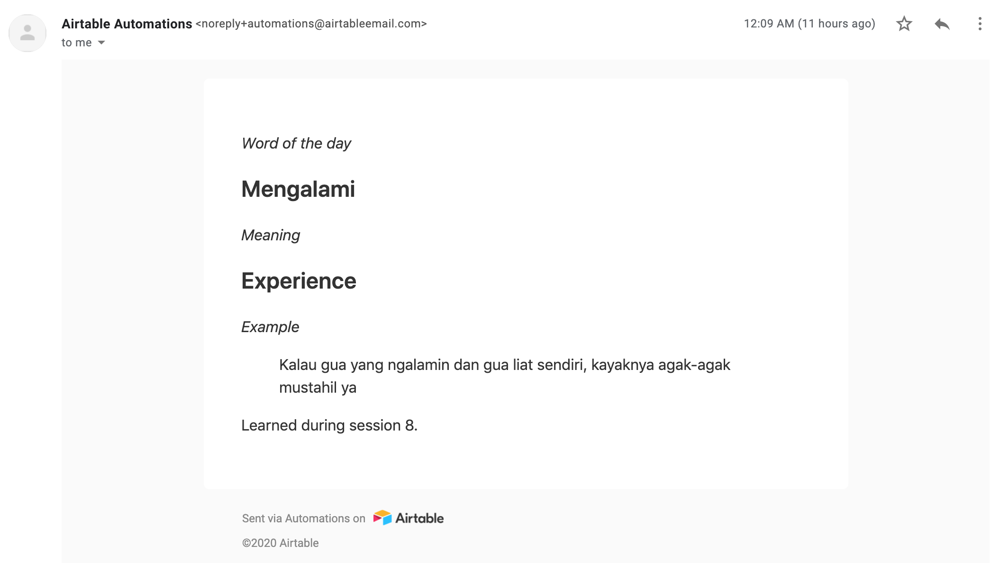
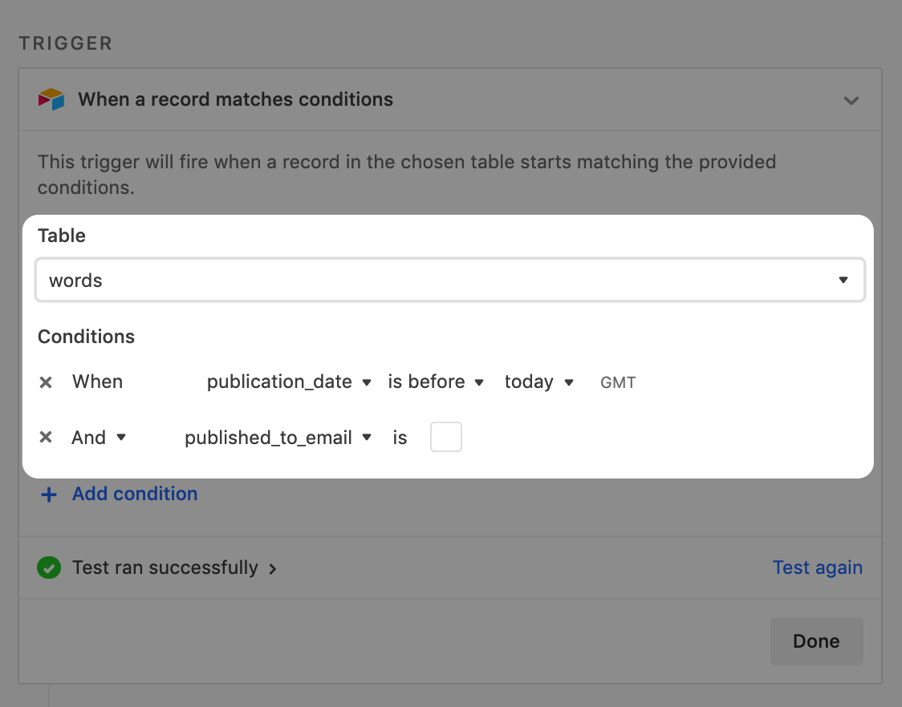
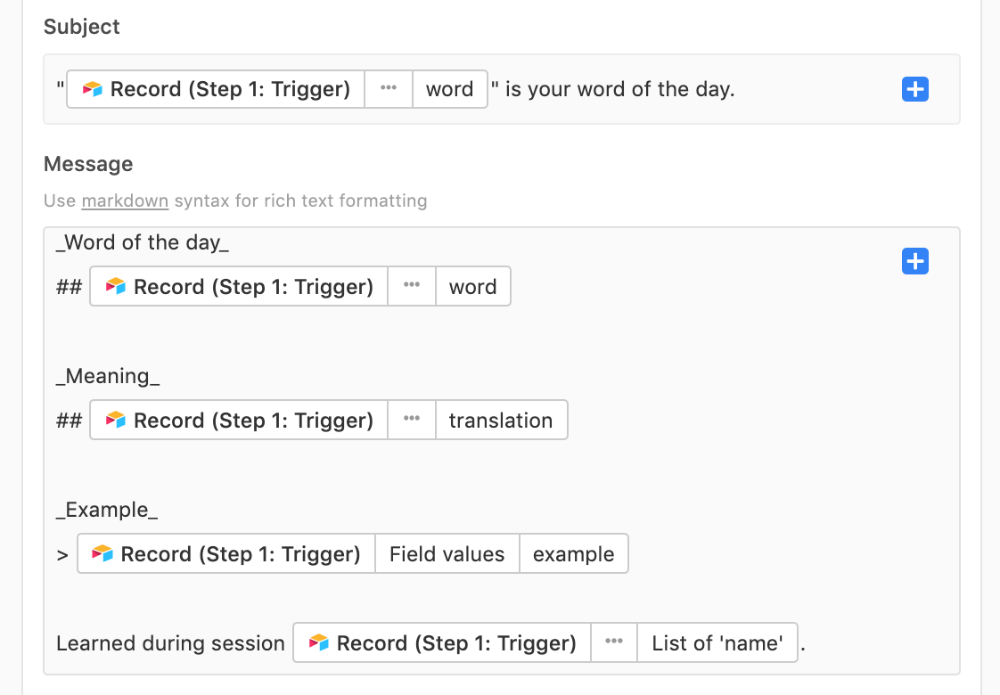

I've been learning a new language (Indonesian) for a year now. I collect the words I learn inside an Airtable spreadsheet, which powers my website [CelotehBahasa](https://www.CelotehBahasa.com). 

To go one step further, I wanted to email myself the new words I learn - one new word a day. I can't believe how simple it was to set up with Airtable Automations! 

Here's how it works. In the table in whcih I record the words I learn:

* I give each word a `schedule_delay`, which has a value of "1" for the first word, "2" for the second word, etc. The field uses Airtable's **Autonumber** field type to automatically increment that number.
* I then take a starting date (Nov. 4), and give each word a unique publication date by incrementing that starting date with the word's `schedule_delay` (Using the **Formula** field type and formula `DATEADD('2020-11-04',schedule_delay,'days')` ).

Now each word in my table has a unique publication date.

<iframe class="airtable-embed" src="https://airtable.com/embed/shrqmlQMhOa86owMi?backgroundColor=yellow" frameborder="0" onmousewheel="" width="100%" height="250" style="background: transparent; border: 1px solid #ccc;"></iframe>

Then, I can use Airtable's automation feature to send myself an email every day, when a particular word reaches its due publication date (and the word hasn't been published in the past: I update a boolean called `published_to_email` for each word as it gets emailed): 

I then populate the "Send an email" action with the word, its translation, and an example to help me remember. 

That's it. The design of the email is clean, it took me 10 minutes to set up, and I'll get words emailed daily until at lest October 2021. 

I hope this was helpful to someone. Let me know [on Twitter]("https://www.twitter.com/theoblochet") if you run any issues setting up something similar, happy to help! 

