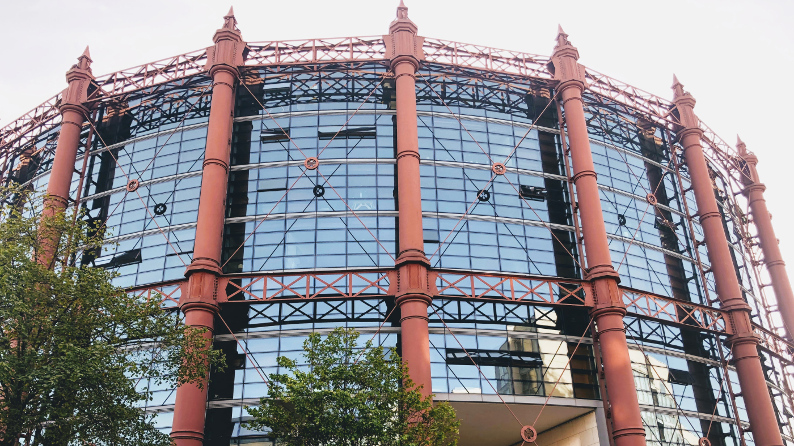
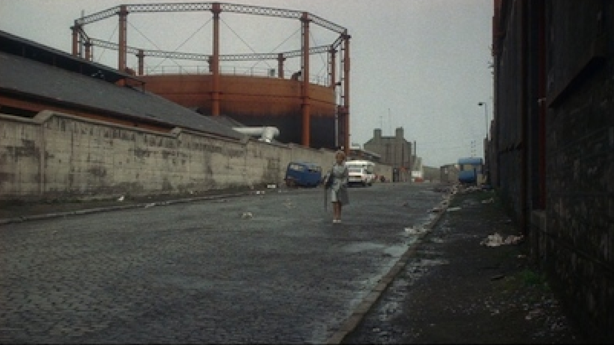
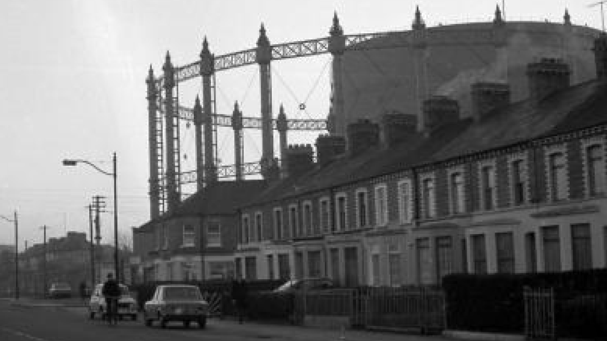
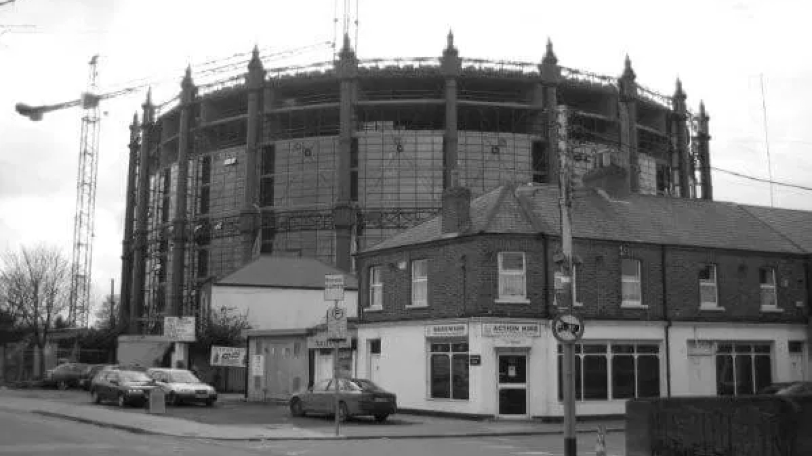
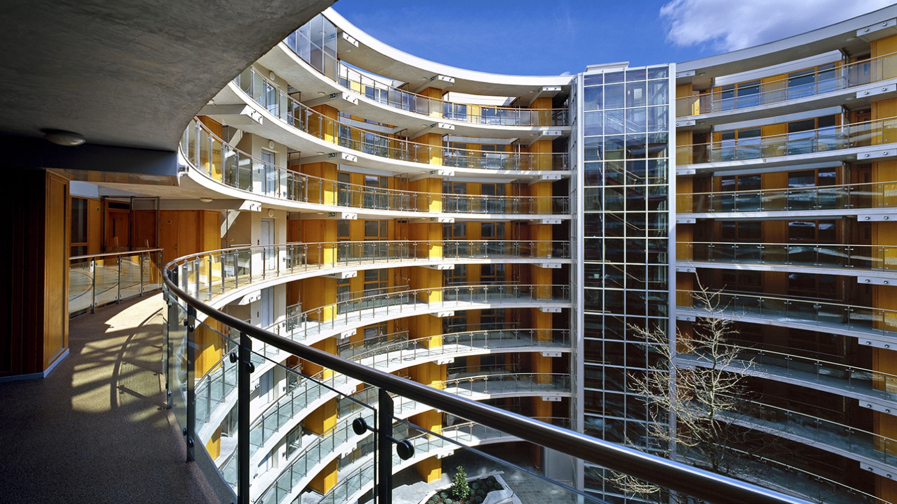

As of June 2020, this building is my home. It's also a rehabilitated, London-made, Victorian-era Gasometer - preserved in the heart of Dublin. 

### Dublin's gas History

In the 18th century, electricity wasn't a thing yet. Dublin kept its streets lit at night with the help of dozens of workers  refuelling each city lamp at night with expensive whale oil or tallow.

One day, the concept of public gas was brought to Dublin from England. Entrepreneurs started gas factories ("gasworks"), storage facilities, and distribution networks. 

During the day, gas workers burned coal to produce gas, andstored it in a large gas holder, often called a “Gasometer”. The network distributed the gas to the 3750 city lamps. It was hard, gruesome work.

> The worst thing about the gas company was the bad working
conditions. The workers should have been sent to the doctors, because
they suffered. It was very unhealthy, the fumes and all that. I think at
some stage they put up a warning that working here is a danger to
health. - Peter Montgomery, 2006 [0] 

When dawn came, 25 lamplighters hurried themselves to light up the city lights.

### Dublin's Gasometers

Gas usage boomed in Dublin. 

It became safer to walk at night. Factories could introduce night shifts. People could light the inside of their home for longer. Gas stoves and water heaters became more widespread. Gas was everywhere.

In 1866, the 5 private gas companies of the time merged into the "*Alliance & Dublin Consumers' Gas Company*", or "the Dublin Gas Company" (for short). The monopoly was now in charge of city-wide production, distribution, and storage.

Gas-related structures emerged in the Dublin South Lotts landscape. In 1871, the newly formed gas monopoly built the Clayton Gas holder. And in 1885, the *Alliance gasometer*. 

### The Alliance Gasometer

London-based Samuel Cutler & Sons wrought the Gas holder’s iron frame, and shipped it to Dublin. Once completed, the gasholder was one of the largest moving metal structures in the world [1]

As workers in the gasworks surrounding the tank produced gas, they pumped it through water into sections of the tank, and the gas holder *lifted itself*, using the iron frame around it as a guide. Check out [this video](https://youtu.be/QxCGta_rsUE?t=371) to see a similar gas holder in action.

> [The gasometers] floated on water, the pressure of the gas kept them up. So they had no bottom, and the gas used to seep into the water, and the smell sometimes got really bad, because there were leaks and the smell of gas was horrendous - Billy Ryan, 2004[0] 

### The downfall 

In the 20th century, Electricity became the norm for public and in-home lighting and killed demand for gas. Natural gas  (extracted from the seabed, rather than from coal) became the cheaper replacement for everything else. 

The Gasworks stopped.. The Dublin Gas Company went bankrupt. All its assets were passed to Bord Gaís [3], then to the Dublin Docklands Port Authority.

_Scene from the movie “Educating Rita” showing the Gasometer with its inner tank, 1983_

### From abandon to luxury real estate

In 1996, a portion of the site (7.8 acre) was sold to developer [Liam Carroll](https://en.wikipedia.org/wiki/Liam_Carroll_(businessman)) of Zoe Developments. Before he could make use of the land though, the Port Authority had to decontaminate the soil from the chemical compounds of its industrial past.

> A [..] wall measuring 8m deep and 2km long was erected to contain the site. The whole area was then excavated to a depth of 4 metres. 

_[Vanishing Dublin](https://www.dublincity.ie/library-galleries1/204?page=5), Dublin City Council, 1980_

The decontamination budget slipped from €12 million [3] to €50 million, and the process took 8 years. In 2004, the site passed inspections - construction could start. 
Architects o’mahony pike built 210 apartments inside the Victorian iron frame, turning the Gasometer into a nine-storey residence. They called it “The Alliance”. 

_Gasworks Ringsend being converted Apartments (Martin-Daly), 2005_

### The Irish property collapse

2006. Ten years after purchasing the land, Carroll finally put the apartments on the market. Unit prices started at €675,000. By July, 40 of the 210 apartments were pre-booked. 

But early signs of the real estate market crash were looming. Banks pulled back on mortgages. Property valuations dropped. The 40 prospective buyers of The Alliance all bailed.[3] 

To save cash, the developers rented the appartments on the cheap to 400 students for a year. Then, in a last desperate attempt, Carroll hired staff and fitted rooms to turn the Alliance into a 52 rooms hotel. But demand wasn't there. People just weren't willing to pay the price.  

Late 2008, the real estate market collapsed. Zoe Developments went bankrupt. Its assets -including the Alliance- were liquidated.Kennedy Wilson purchased The Alliance in 2011 for €42 million, valuing each appartment at €200k - one third of the starting price Carroll tried to sell them for 2 years earlier. 

### Google's salvation 

That same year of 2011, Google acquired the buildings across the street from the Alliance [5]. The neighborhood became the home of Google’s booming 1,200 staff. Their young workforce loved living right next to the office, making up 80% of The Alliance’s residents. [6]

Rents soared. In late 2020,  hundreds of tech employees from all over the world still happily pay €2,100 for a two-bedrooms in the residence (myself included). 

With COVID-19 raging, Google, Facebook and others have announced that they wouldn't require employees to come back to their Dublin offices until mid-2021. It is becoming increasingly likely that they will introduce flexible remote policies for their employees to work out of anywhere in Europe. 

Now that location doesn’t condition their paychecks anymore, tech workers are on the move. Every week, movers' trucks park in the Alliance's inner courtyard, and one more family moves out of the country. The building management company introduced a €150 referral program, hoping to fill empty units. 

After 10 years of prosperity, is another dark episode around the corner?

---

[0]  Astrid Wonneberger, "[Salvaging the Past - Shaping the future. Perceptions of changes in the South Docklands](https://www.ethnologie.uni-hamburg.de/pdfs-de/Astrid-Wonneberger/heritage-projekt-docklands-final-version-astridwonneberger.pdf)"

[1] Turtle Bundury, "[The Docklands - Ringsend and poolbeg](https://web.archive.org/web/20130821041013/http://www.turtlebunbury.com/published/published_books/docklands/Ringsend%20&%20Poolbeg/pub_books_docklands_rd_gasholder.html)"

[2] The Irish times, "[Dublin's toxic gasworks material could end up as part of dutch road network](https://www.irishtimes.com/life-and-style/homes-and-property/dublin-s-toxic-gasworks-material-could-end-up-as-part-of-dutch-road-network-1.176289)"

[3] The Irish times, "[Gasworks building may make up to €42m](https://www.irishtimes.com/business/commercial-property/gasworks-building-may-make-up-to-42m-1.603326)""

[4] o'mahony pike, "[The Gasworks](https://omahonypike.ie/projects/gasworks/)""

[5] Silicon Republic, "[Google Acquires Barrow Street EMEA HQ Buildings](https://www.siliconrepublic.com/companies/google-acquires-barrow-street-emea-hq-buildings)""

[6] The Irish times, "[A mile away, but miles apart](https://www.irishtimes.com/news/a-mile-away-but-miles-apart-1.530516)""

