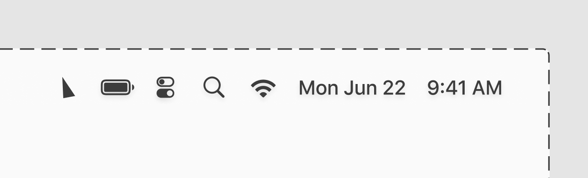
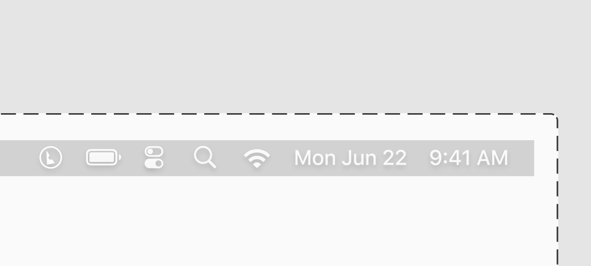
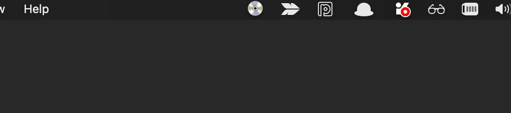

### Opportunity

TheLotRadio is an independent non-profit online radio station. They have killer music on everyday.
However, the options to listen to their sounds are a bit limited: you've got the [website](https://www.thelotradio.com), which has a video livstream, and an audio livestream. There's also an iPhone app, which hasn't been updated in years.

### Solution

I want to build a very simple mac app, which would let me tune into thelotradio's audio feed in one click.
It could be as simple as the triangle icon below: hit it to start play, hit it again to stop play.

### Process

#### Design

I'm exploring a few variants for the icons. It could be a simple triangle:



Alternatively I like the idea of using a vinyl icon, with the triangle logo on it:



I'll go with the second — a record seems more straightforward, and spinning it when the music is playing will help make what's happening very clear.

#### Code

So here I need to be able to:

- Create a menubar macc app (I'll follow this [tutorial](https://www.youtube.com/watch?v=ii89L7LVAs4&t=3594s) about that)
- Make it so clicking the icon triggers an audiostream to start
- Make it that clicking again then stops the stream
- Ideally, make the icon spin while it's playing, make it stop spinning when it's not.

I'm creating a new app via xCode, picking "MacOS", and "ViewControllers" to start a new project.
By default, Mac Apps appear in the doc, so I need to:

- Edit `info.plist`, adding a row called `Application is agent (UIElement)`, and setting it to `YES`. This tells MacOS not to display my app in the dock.
- updated my `AppDelegate.swift` file to override this:

```swift:title=appdelegate.swift
import Cocoa

@main
class AppDelegate: NSObject, NSApplicationDelegate {
    let statusitem = NSStatusBar.system.statusItem(withLength: NSStatusItem.variableLength)

    func applicationDidFinishLaunching(_ aNotification: Notification) {
        // Set a status bar item with a 💿 button "
        statusitem.button?.title = "💿"
        // Define what happens when it is clicked
        statusitem.button?.target = self
        statusitem.button?.action = #selector(playFeed)
    }

    func applicationWillTerminate(_ aNotification: Notification) {
        // Insert code here to tear down your application
    }

    @objc func playFeed () {
        // Change the app's status bar to 💃🏻"
        statusitem.button?.title = "💃🏻"
    }
}
```


Success! My app is now running as a disc emoji in my mac's menubar! 🔥

Now, I need that, when clicked, it starts streaming the audiofeed.
To do that, it seems like I need to use something called [AvPlayer](https://developer.apple.com/documentation/avfoundation/avplayer).

> An AVPlayer is a controller object used to manage the playback and timing of a media asset. You can use an AVPlayer to play local and remote file-based media, such as QuickTime movies and MP3 audio files, as well as audiovisual media served using HTTP Live Streaming.

Sounds exactly like what I need. I have _no_ idea how to use it in my appdelegate.swift file though.

To recap, I now have a mac menubar icon. When it is clicked, it calls the function `playFeed`.
Inside that function, I declare a URL variable pointing to [the audio feed I want](http://thelot.out.airtime.pro:8000/thelot_b).
Then I would need to know how to play audio in the background.

However — looking for sample code or help is surprisingly difficult. Most of the examples are [for ios](https://stackoverflow.com/questions/30280519/how-to-play-audio-in-background-with-swift) and do not apply to mac.
Responses in stackoverflow lack context about where the code should be used, often mix Swift versions, devices, etc.
It's been two hours that I've been searching how to play an audio file, and I'm stuck here.

Too bad.
